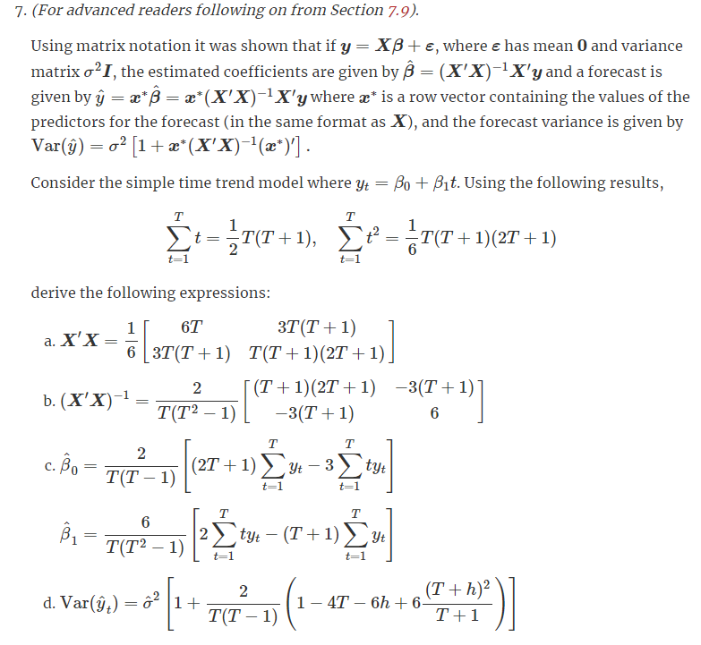

```{r setup, include=FALSE}
knitr::opts_chunk$set(echo = FALSE,
                      message = FALSE,
                      warning = FALSE,
                      fig.align = "center",
                      cache = TRUE,
                      fig.width = 12)

source("preamble.R")

```

# Exercise 01

> Half-hourly electricity demand for Victoria, Australia is contained in vic_elec. Extract the January 2014 electricity demand, and aggregate this data to daily with daily total demands and maximum temperatures.

```{r, echo=TRUE}
jan14_vic_elec <- vic_elec %>%
  filter(yearmonth(Time) == yearmonth("2014 Jan")) %>%
  index_by(Date = as_date(Time)) %>%
  summarise(
    Demand = sum(Demand),
    Temperature = max(Temperature)
  )
```

> a. Plot the data and find the regression model for Demand with temperature as a predictor variable. Why is there a positive relationship?

```{r}

jan14_vic_elec %>% 
    ggplot(aes(y = Demand, x = Temperature)) +
    geom_point() +
    geom_smooth(method = "lm") +
    labs(title = "Demand vs. Electricity (Victoria, Australia)")

# formal definition of the model

fit_lm <- jan14_vic_elec %>% 
    model(TSLM(Demand ~ Temperature))

fit_lm %>% 
    report()


```

There is a positive relationship since the hotter it gets, the more electricity gets spent on cooling (air conditioners etc.).


> b. Produce a residual plot. Is the model adequate? Are there any outliers or influential observations?

```{r}

fit_lm %>% 
    gg_tsresiduals()


augment(fit_lm) %>% 
    pull(.resid) %>% 
    shapiro.test()

```

The model is adequate since the errors are uncorrelated and are mostly normally distributed (Shapiro–Wilk test gives p-value of 0.06978). There are no outliers.


> Use the model to forecast the electricity demand that you would expect for the next day if the maximum temperature was 15$^\circ$C and compare it with the forecast if the with maximum temperature was 35$^\circ$C . Do you believe these forecasts? The following R code will get you started:

```{r, echo=TRUE}

plot_forecast <- function(target_temp) {
    out <- fit_lm %>%
  forecast(
    new_data(jan14_vic_elec, 1) %>%
      mutate(Temperature = target_temp)
  ) %>%
  autoplot(jan14_vic_elec) +
        geom_point(aes(color = Temperature, x = Date, y = Demand), size = 5) +
        scale_color_viridis_c() +
        scale_y_continuous(limits = c(100e3, 350e3),
                           labels = scales::comma_format(),
                           n.breaks = 10)
    
    return(out)
}

cowplot::plot_grid(
    plot_forecast(15),
    plot_forecast(35)
)

jan14_vic_elec %>% 
    as_tibble() %>% 
    arrange(Temperature)

```

The forecast for first plot seems dodgy, since the value of Temperature = 15 was never seen in the data. Therefore, we are extrapolating. Let's see the predicted values for a range of numbers:

```{r}

get_prediction <- function(target_temp) {
    out <- fit_lm %>% 
        forecast(new_data(jan14_vic_elec, 1) %>% mutate(Temperature = target_temp)) %>% 
        pull(.mean)
    
    return(out)
}

var_target_temp <- seq(-30, 40, 0.5)
var_predict_demand <- sapply(var_target_temp, get_prediction)

tibble(Demand = var_predict_demand, Temperature = var_target_temp) %>% 
    ggplot(aes(x = Temperature, y = Demand)) +
    geom_line(color = "blue") +
    geom_hline(yintercept = 0, lty = 1, color = "red", size = 2, alpha = 0.5) +
    scale_x_continuous(n.breaks = 20)

```

I doubt that people will not use electricity when it is cold. :)

> Give prediction intervals for your forecasts.

```{r}

get_fable_summaries <- function(target_temp) {
    out <- fit_lm %>%
  forecast(
    new_data(jan14_vic_elec, 1) %>%
      mutate(Temperature = target_temp)) %>% 
        hilo(Demand, level = c(80, 95)) %>% 
        as_tibble()
    
    return(out)
}

var_results <- lapply(c(15, 35), get_fable_summaries) %>% 
    bind_rows()

qc <- function(x) {
    return(scales::comma(x, accuracy = 1, scale = 1, big.mark = ".", decimal.mark = ","))
}

for (i in seq_along(var_results$Demand)) {
    local_95_percent_interval <- var_results$`95%`[i]
    
    lower <- local_95_percent_interval$lower
    upper <- local_95_percent_interval$upper
    
    message <- glue::glue("When the temperature is {var_results$Temperature[i]}*C, on average we can expect total electricity demand of {var_results$.mean[i] %>% qc()} MWH. We can 95% sure that the demand will be between {lower %>% qc()} and {upper %>% qc()} MWH.")
    
    cat(message, sep = "\n")
    cat("\n")
    
    
    
}

```


> Plot Demand vs Temperature for all of the available data in `vic_elec` aggregated to daily total demand and maximum temperature. What does this say about your model?

```{r}

vic_elec_total_daily <- vic_elec %>% 
    as_tibble() %>% 
    group_by(Date) %>% 
    summarise(Demand = sum(Demand),
              Temperature = max(Temperature)) %>% 
    as_tsibble(index = Date)

fit_lm_all_data <- vic_elec_total_daily %>% 
    model(TSLM(Demand ~ Temperature))

fit_lm_all_data %>% 
    report()

plot_01 <- fit_lm_all_data %>% 
    augment() %>% 
    ggplot(aes(x = Demand, y = .fitted)) +
    geom_point(size = 2) +
    geom_abline(intercept = 0, slope = 1, color = "purple", lty = 1, size = 2, alpha = 0.5) +
    labs(x = "True Value", y = "Predicted Value")

plot_02 <- fit_lm_all_data %>% 
    augment() %>%
    select(Date, Demand, .fitted) %>% 
    pivot_longer(-Date) %>% 
    ggplot(aes(x = Date, y = value, col = name)) +
    geom_line(alpha = 0.5) +
    scale_color_manual(label = c("Fitted", "Actual"),
                       values = c("red", "blue"))

cowplot::plot_grid(
    plot_01,
    plot_02,
    align = "v"
)

```

This tells me that the relationship between Demand and Temperature is non-linear. Linear model is not good for modelling this kind of relationship. There is also lots of seasonality present ... 

# Exercise 02

> Data set `olympic_running` contains the winning times (in seconds) in each Olympic Games sprint, middle-distance and long-distance track events from 1896 to 2016.

> a. Plot the winning time against the year for each event. Describe the main features of the plot.

```{r, fig.height=10}

olympic_running %>% 
    autoplot(Time) +
    facet_wrap(Sex ~ Length, scales = "free") +
    labs(y = "Time (seconds)") +
    theme(legend.position = "none") +
    scale_x_continuous(n.breaks = 5)

```

Gap is present in the data due to the WWII. Most series have downward trend. In some series we can see that the new winning records are actually worse than the past records.

> b. Fit a regression line to the data for each event. Obviously the winning times have been decreasing, but at what average rate per year?

```{r}

fit <- olympic_running %>% 
    model(TSLM(Time ~ Year)) 
    
fit %>% 
    coef() %>% 
    filter(term == "Year") %>% 
    arrange(estimate)

```

We can see the biggest downward trend in the category 10.000 / women: every year, the winning time is lower by 3.50 seconds on average. Unfortunately, in one of the series, winning times are actually increasing on average: 1.500 / women.

> c. Plot the residuals against the year. What does this indicate about the suitability of the fitted lines?

```{r, fig.height=10}

r_squared <- fit %>% 
    glance() %>% 
    select(Length:r_squared) %>% 
    arrange(r_squared) %>% 
    mutate(message = glue::glue("R^2 = {scales::percent(r_squared, accuracy = 0.01)}") %>% as.character()) 


fit %>% 
    augment() %>% 
    ggplot(aes(x = Time, y = .fitted)) +
    geom_point() +
    geom_abline(intercept = 0, slope = 1) +
    facet_wrap(Sex ~ Length, scales = "free") +
    geom_text(aes(x = -Inf, y = Inf, label = message),
               data = r_squared,
               size = 3,
               hjust = -0.5,
               vjust = 8,
              color = "red") +
    labs(x = "Actual Values", y = "Predicted Values")

```

Most models are quite good (judging by the $R^2$), while the rest of the models need some improvement. Most worrisome is 5000 / women and 1500 / women.


> d. Predict the winning time for each race in the 2020 Olympics. Give a prediction interval for your forecasts. What assumptions have you made in these calculations?

```{r, fig.height=10}

new_data <- expand.grid(
    unique(olympic_running$Sex),
    unique(olympic_running$Length),
    seq(2020, length.out = 3, by = 4)
) %>% 
    as_tibble() %>% 
    purrr::set_names(nm = c("Sex", "Length", "Year")) %>% 
    as_tsibble(index = Year, key = c("Length", "Sex"))

fit %>% 
    forecast(new_data) %>% 
    autoplot(olympic_running) +
    facet_wrap(Sex ~ Length, scales = "free")

```

I've made a decision to forecast next 3 relevant years (2020, 2024, 2028). The problematic models identified earlier show neutral or positive trend, which is nonsensical.

Anyways, the assumption are:

* Model is a reasonable approximation to reality.
* Characteristics of residuals:
    * Mean of zero.
    * No autocorrelation.
    * They are unrelated to the predictor variables.
    * Useful feature: residuals are normally distributed with a constant variance of $\sigma^2$ in order to easily produce prediction intervals.
    * Each predictor $x$ is not a random variable. We are violation this assumption here since these are observational data. In the context of time series, we are not controlling for predictor $x$, we are observing it.


# Exercise 03

> An elasticity coefficient is the ratio of the percentage change in the forecast variable ($y$) to the percentage change in the predictor variable ($x$). Mathematically, the elasticity is defined as $(dy / dx) \times (x/y)$. Consider the log-log model:

$$ \log{y} = \beta_0 + \beta_1 \log{x} + \epsilon $$

> Express $y$ as a function of $x$ and show that the coefficient $\beta_{1}$ is the elasticity coefficient.

Helpful links: [link_01](https://stats.stackexchange.com/questions/91636/how-to-obtain-the-elasticity-from-a-log-level-regression), [link_02](https://stats.stackexchange.com/questions/9913/elasticity-of-log-log-regression) and [link_03](https://stats.stackexchange.com/questions/240660/log-log-elasticities-estimation).

Solution - first, we ignore $\epsilon$ as unrelated to $y$, and then we can apply chain rule:

$$ \frac{d \log{y}}{d \log{x}} = \frac{d \log{y}}{d y} \frac{d y}{d x} \frac{d x}{d log x} $$

We apply derivation rules to relevant functions ([reminder](https://www.mathsisfun.com/calculus/derivatives-rules.html)):

$$ \frac{d \log{y}}{d y} = \frac{1}{y} $$

$$ \frac{d x}{d log x} = x $$
Applying these conclusions to the first equation yields us:


$$ \frac{d \log{y}}{d \log{x}} = \frac{d \log{y}}{d y} \frac{dy}{dx} \frac{dx}{d log x} = \frac{1}{y} \frac{dy}{dx} x = \frac{dy}{dx} \frac{x}{y} $$

... which is exactly the definition of elasticity as mentioned in the exercise.

# Exercise 04

> The data set `souvenirs` concerns the monthly sales figures of a shop which opened in January 1987 and sells gifts, souvenirs, and novelties. The shop is situated on the wharf at a beach resort town in Queensland, Australia. The sales volume varies with the seasonal population of tourists. There is a large influx of visitors to the town at Christmas and for the local surfing festival, held every March since 1988. Over time, the shop has expanded its premises, range of products, and staff.

> a. Produce a time plot of the data and describe the patterns in the graph. Identify any unusual or unexpected fluctuations in the time series.

```{r}

souvenirs %>% 
    autoplot(Sales)


```

Exponential growth last three years.

> b. Explain why it is necessary to take logarithms of these data before fitting a model.

Relevant sources: [here](https://stats.stackexchange.com/questions/482182/why-is-transforming-data-valid-and-how-do-we-know-in-general-that-any-given-t), [here](https://stats.stackexchange.com/questions/18844/when-and-why-should-you-take-the-log-of-a-distribution-of-numbers), [here](https://stats.stackexchange.com/questions/445112/log-transformation-before-modeling), [here](https://stats.stackexchange.com/questions/30728/how-small-a-quantity-should-be-added-to-x-to-avoid-taking-the-log-of-zero) and [here](https://stats.stackexchange.com/questions/4831/regression-transforming-variables) (last resource was extremely helpful).

```{r}

plot_01 <- souvenirs %>% 
    ggplot(aes(x = Sales)) +
    geom_histogram(aes(y = ..density..), color = "black", fill = "white") +
    geom_density(fill = "blue", alpha = 0.25) +
    labs(title = "Distribution of Sales (raw)")

plot_02 <- souvenirs %>% 
    ggplot(aes(x = log(Sales))) +
    geom_histogram(aes(y = ..density..), color = "black", fill = "white") +
    geom_density(fill = "blue", alpha = 0.25) +
    labs(title = "Distribution of Sales (logged)")

plot_03 <- souvenirs %>% 
    autoplot(Sales) +
    labs(title = "Sales data (raw)") +
    stat_smooth(method = "lm")

plot_04 <- souvenirs %>% 
    mutate(Sales = log(Sales)) %>% 
    autoplot(Sales) +
    labs(title = "Sales data (logged)") +
    stat_smooth(method = "lm")


cowplot::plot_grid(plot_01, plot_02, plot_03, plot_04)

```

Reasons for transformation of data is immediately apparent in the plot: the transformed, dependent variable now has linear relationship to predictor variable, so it will be easier to model. Also, logged data is no longer skewed and there is added bonus of reducing heteroscedasticity of the transformed data.


> c. Fit a regression model to the logarithms of these sales data with a linear trend, seasonal dummies and a “surfing festival” dummy variable.

Info: surfing festival is held annually in March ([source](https://nomadsworld.com/noosa-festival-of-surfing/)):

> Date: 10th – 17th March **The Noosa festival of surfing is held annually in March**, in one of the world's great surf locations. First Point at Noosa Heads is a perfect surfing spot for longboard surfing (apparently). This is due to the breezes from the South-East going around the tip of Noosa National Park.

<p align="center">
  
</p>

Note: previous edition of the book had this same task, and two solution )[here](https://rpubs.com/samneil/791565) and [here](https://rpubs.com/Dan_Dychala/hynd5-6)) explicitly modeled dummy variable taking into account the year from which competition started.

```{r, echo=TRUE}

souvenirs_mod <- souvenirs %>% 
    mutate(SurfingFestival = month(Month) == 3 & year(Month) >= 1988)

souvenirs_fit <- souvenirs_mod %>% 
    model(TSLM(log(Sales) ~ trend() + season() + SurfingFestival))


report(souvenirs_fit)

```

> d. Plot the residuals against time and against the fitted values. Do these plots reveal any problems with the model?

```{r}

souvenirs_fit %>% 
    gg_tsresiduals()

```

Some autocorrelation is left in the residuals, but it's nothing alarming. Residuals also seem slightly (but only sightly skewed). Are they normal?

```{r}

augment(souvenirs_fit) %>% 
    pull(.innov) %>% 
    shapiro.test()

```

Yes, they are. 💪

Now, to plot the residuals against the fitted values:


```{r}

augment(souvenirs_fit) %>% 
    ggplot(aes(x = .innov, y = log(.fitted))) +
    geom_point() 

```

No obvious pattern in the residuals after accounting for trand, seasonality and March festival.

EXTRA: we can check the accuracy of the model in the following way:

```{r}

augment(souvenirs_fit) %>% 
    ggplot(aes(x = log(Sales), y = log(.fitted))) +
    geom_point() +
    geom_abline(intercept = 0, slope = 1, color = "purple", size = 3, alpha = 0.25)


```

<p align="center">
  
</p>

> e. Do boxplots of the residuals for each month. Does this reveal any problems with the model?

```{r}

plot_density <- augment(souvenirs_fit) %>% 
    mutate(MonthName = month(Month, TRUE)) %>% 
    ggplot(aes(x = log(.fitted))) +
    geom_density(fill = "steelblue") +
    facet_wrap(. ~ MonthName) +
    scale_x_continuous(limits = c(5, 15))


plot_boxplot <- augment(souvenirs_fit) %>% 
    mutate(MonthName = month(Month, TRUE)) %>% 
    ggplot(aes(x = log(.fitted), y = MonthName)) +
    geom_boxplot(fill = "steelblue") +
    coord_flip()

cowplot::plot_grid(plot_density, plot_boxplot)

```

The model makes the biggest residuals in November and December. Also, the residuals in March are interesting: could the sudden shift be due to the Surfing Festival? Did we account for all information?

Residuals for each month are also normally distributed.

```{r}

augment_with_months <- augment(souvenirs_fit) %>% 
    mutate(MonthNum = month(Month))

get_shapiro_pvalue <- function(month_num) {
    x <- augment_with_months %>% 
        filter(MonthNum == month_num) %>% 
        pull(.innov) %>% 
        shapiro.test()
    
    return(x$p.value)
}

get_variance <- function(month_num) {
    x <- augment_with_months %>% 
        filter(MonthNum == month_num) %>% 
        pull(.innov)
    
    return(var(x))
}

diagnostics <- tibble(Month = 1:12) %>% 
    mutate(pvalue = sapply(Month, get_shapiro_pvalue),
           variance = sapply(Month, get_variance))

diagnostics
```

At significance level of 5%, we can reject the null hypothesis that the residuals are not normally distributed in all months except December (tho we are very close).

But, there is some heteroskedasticity present, but IMO it is not cause for concern.

> f. What do the values of the coefficients tell you about each variable?

```{r}

souvenirs_fit %>% 
    report()

```

The model captured positive trend that is visible in the data. For example, if we are forecasting for March of any year, we can on average expect that log(Sales) will be bigger by 0.5015151. Regarding `season()year_INT` values, let's interpret `season()year2` coefficient: we are expecting (on average) that the log of future sales will be 25% bigger compared to the log of sales of 2 years prior. 

> g. What does the [Ljung-Box test](https://en.wikipedia.org/wiki/Ljung%E2%80%93Box_test) tell you about your model?

Important resource: [for interpretation of the test, especially regarding p-values](https://stats.stackexchange.com/questions/64711/ljung-box-statistics-for-arima-residuals-in-r-confusing-test-results). Hyndman also has great [article](https://robjhyndman.com/hyndsight/ljung-box-test/) on the topic of appropriate lags.

```{r, echo=TRUE}
# based on Hyndman's article, linked above
TARGET_LAG <- min(nrow(souvenirs_mod) / 5, 2 * 12) %>% round(0)

augment(souvenirs_fit) %>% 
    features(.innov, ljung_box, lag = TARGET_LAG) 

```

The p-value is very close to zero, and we can reject the $H_{0}$ that the data is independently distributed. In other words, residuals exhibit autocorrelation at the specified lag. This means that there might be some problems with the forecasts because of the autocorrelation or heteroskedasticity in our residuals.

> h. Regardless of your answers to the above questions, use your regression model to predict the monthly sales for 1994, 1995, and 1996. Produce prediction intervals for each of your forecasts.

```{r}

new_data <- tibble(Month = seq.Date(as.Date("1994-01-01"), length.out = 36, by = "1 month")) %>% 
    mutate(Month = yearmonth(Month)) %>% 
    mutate(SurfingFestival = month(Month) == 3 & year(Month) >= 1988) %>% 
    as_tsibble(index = Month)
    

souvenirs_fit %>% 
    forecast(new_data = new_data) %>% 
    autoplot(souvenirs_mod) +
    scale_y_log10()


```

> i. How could you improve these predictions by modifying the model?

We could probably add even more holiday seasons and/or encode month name/number as category.

# Exercise 05

> The `us_gasoline` series consists of weekly data for supplies of US finished motor gasoline product, from 2 February 1991 to 20 January 2017. The units are in “million barrels per day”. Consider only the data to the end of 2004.

> a. Fit a harmonic regression with trend to the data. Experiment with changing the number Fourier terms. Plot the observed gasoline and fitted values and comment on what you see.

```{r}

us_gasoline_until_2014 <- us_gasoline %>% 
    filter(year(Week) <= 2004)

us_gasoline_until_2014 %>% 
    autoplot(Barrels)

us_gasoline_until_2014_fit_fourier <- us_gasoline_until_2014 %>% 
    model(TSLM(Barrels ~ trend() + fourier(K = 2)))

us_gasoline_until_2014_fit_fourier %>% 
    forecast(new_data = us_gasoline_until_2014) %>% 
    autoplot(us_gasoline_until_2014)

```

I see that the time series are very well approximated by Fourier Series. The correct value of K should be found by testing AIC vs. the K parameter.

> b. Select the appropriate number of Fourier terms to include by minimising the AICc or CV value.

```{r}

get_aic_value <- function(K) {
    out <- us_gasoline_until_2014 %>% 
        model(TSLM(Barrels ~ trend() + fourier(K = K))) %>% 
        glance() %>%
        mutate(K = K) %>% 
        as_tibble()
    
    return(out)
}

possible_ks <- seq(2, 26, 1)

list_outs <- lapply(possible_ks, get_aic_value) %>% 
    bind_rows() %>% 
    select(AIC, K) %>% 
    arrange(AIC)

FINAL_MODEL_K_VALUE <- list_outs$K[list_outs$AIC == min(list_outs$AIC)]

list_outs

list_outs %>% 
    ggplot(aes(x = K, y = AIC)) +
    geom_point(size = 3) +
    geom_line() +
    geom_vline(xintercept = FINAL_MODEL_K_VALUE, color = "purple", size = 3, alpha = 0.25) +
    scale_x_continuous(breaks = seq(0, 1000, 2))


```

> c. Plot the residuals of the final model using the `gg_tsresiduals()` function and comment on these. Use a Ljung-Box test to check for residual autocorrelation.

```{r}

us_gasoline_until_2014_fit_fourier_optimal <- us_gasoline_until_2014 %>% 
    model(TSLM(Barrels ~ trend() + fourier(K = FINAL_MODEL_K_VALUE)))

us_gasoline_until_2014_fit_fourier_optimal %>% 
    gg_tsresiduals()

```

Constant variance / mean of residuals, residuals are uncorrelated and normally distributed. Awesome!

> d. Generate forecasts for the next year of data and plot these along with the actual data for 2005. Comment on the forecasts.

```{r}

us_gasoline_until_2014_fit_fourier_optimal %>% 
    forecast(new_data = us_gasoline %>% filter(year(Week) == 2005)) %>% 
    autoplot(us_gasoline %>% filter(year(Week) <= 2005))

```

Reasonable forecast.

# Exercise 06

> The annual population of Afghanistan is available in the `global_economy` data set.

> a. Plot the data and comment on its features. Can you observe the effect of the Soviet-Afghan war?

```{r}

afghanistan_population <- global_economy %>% 
    filter(Country == "Afghanistan") %>% 
    select(Population)

START_WAR <- lubridate::dmy("24.12.1979") %>% year()
END_WAR <- lubridate::dmy("15.12.1989") %>% year()

rect <- tibble(
    xmin = START_WAR,
    xmax = END_WAR,
    ymin = -Inf,
    ymax = Inf
)

autoplot(afghanistan_population, Population) +
    geom_rect(data = rect,
              aes(xmin = xmin, xmax = xmax, ymin = ymin, ymax = ymax),
              fill = "blue",
              alpha = 0.25,
              inherit.aes = FALSE)

```

Graph speaks for itself.

> b. Fit a linear trend model and compare this to a piecewise linear trend model with knots at 1980 and 1989.

```{r}

afghanistan_population_fit <- afghanistan_population %>% 
    model(TSLM(Population ~ trend()),
          TSLM(Population ~ trend(knots = c(1980, 1989))))

afghanistan_population_fit %>% 
    forecast(new_data = afghanistan_population) %>% 
    autoplot(afghanistan_population) +
    facet_wrap(. ~ .model) +
    scale_fill_brewer(palette = "Set1")


```

Well, it's obvious that the second model better fits the training data.

> c. Generate forecasts from these two models for the five years after the end of the data, and comment on the results.

```{r}

afghanistan_population_fit %>% 
    forecast(h = 5) %>% 
    autoplot(afghanistan_population) +
    facet_wrap(. ~ .model) +
    scale_fill_brewer(palette = "Set1") 

```

First model forecasts downward trajectory of the population because it takes into account the Soviet-Afghan war in it's calculations. On the other hand, second model generates more sensible forecasts since the war was one-time event (which was taken care of with knots in the model). 

# Exercise 07

<p align="center">
  
</p>

**I could probably do it, but I want to go on with the book, so... ** 😊

<p align="center">
  
</p>